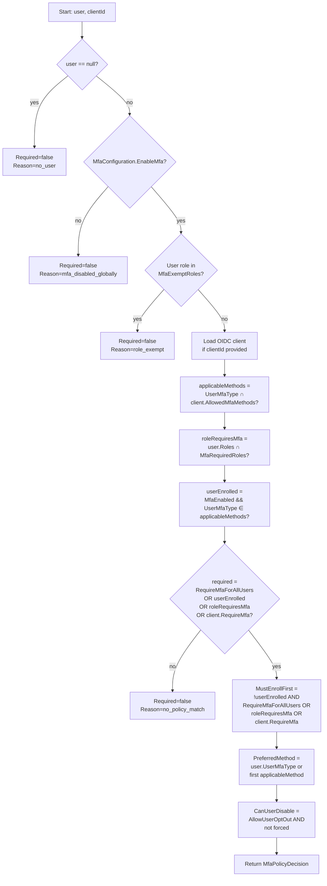
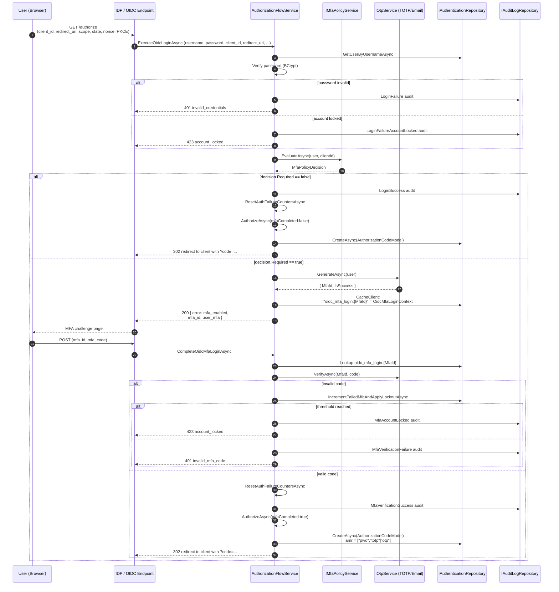
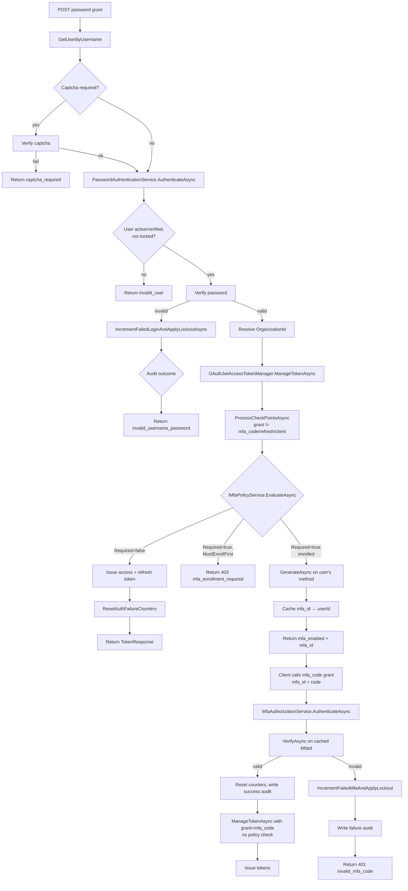
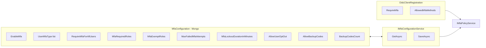
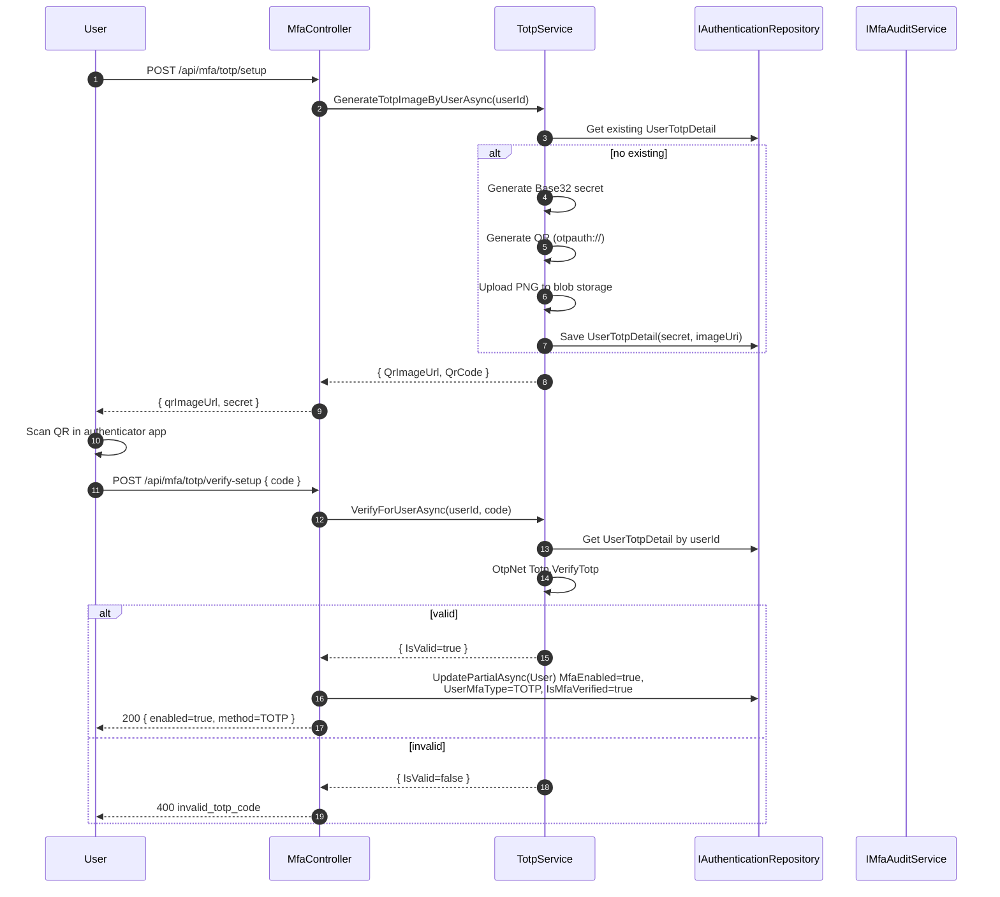
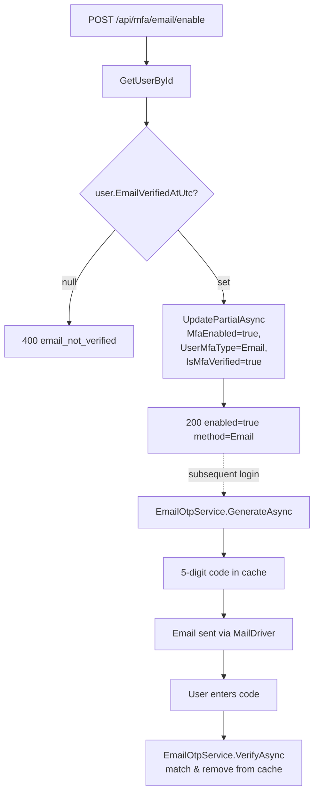
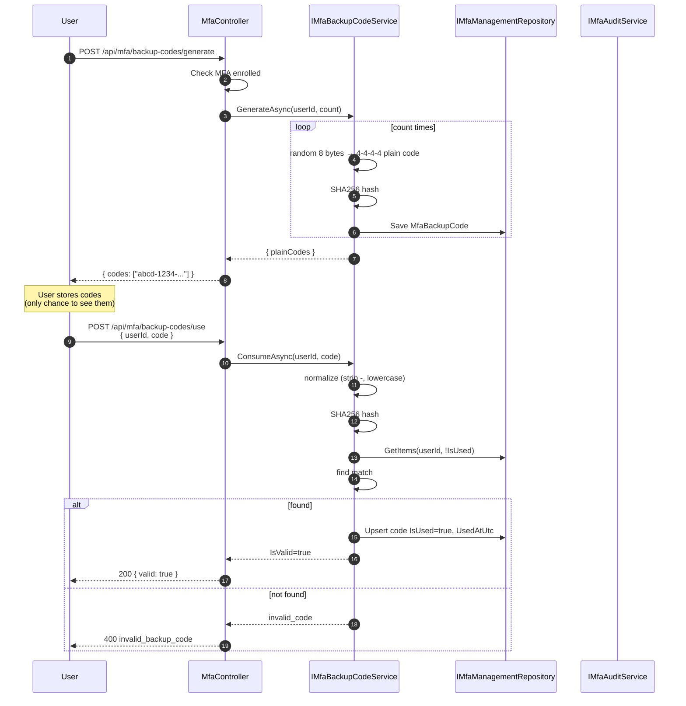
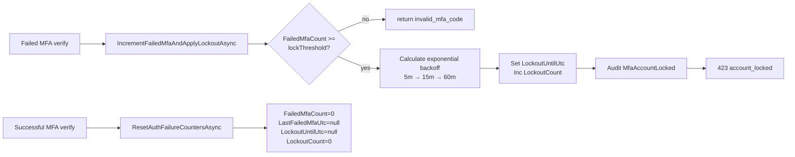
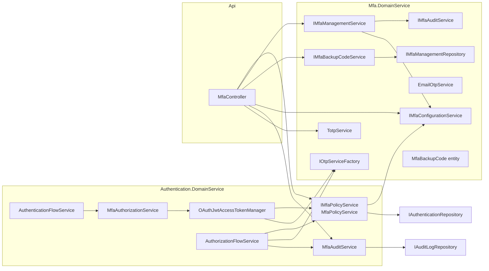
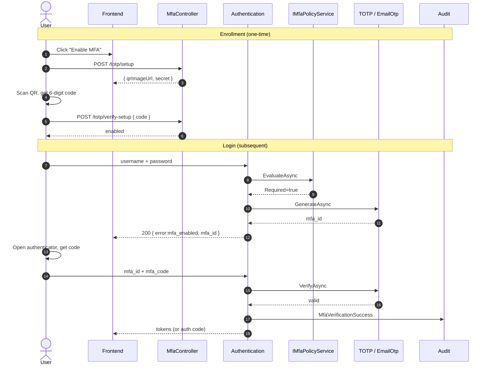

# MFA Flow Diagrams

This document captures the end-to-end MFA flow implemented across the project. Diagrams are in Mermaid and can be rendered in GitHub / VS Code.

---

## 1. Policy Decision — `IMfaPolicyService.EvaluateAsync`

Single source of truth for "is MFA required for this user on this request?". Combines 5 sources into one `MfaPolicyDecision`.



**Triggers that force MFA on**:

| Source | Field | When it fires |
|---|---|---|
| Tenant | `MfaConfiguration.RequireMfaForAllUsers` | All enrolled-capable users |
| Role | `MfaConfiguration.MfaRequiredRoles` | Any of `user.Roles.Keys` matches |
| OIDC Client | `OidcClientRegistration.RequireMfa` | This specific client |
| User | `user.MfaEnabled` | User has self-enrolled |
| Exempt | `MfaConfiguration.MfaExemptRoles` | Short-circuits all of the above |

---

## 2. OIDC Authorization Code Login (Browser Flow)

`AuthorizationFlowService.ExecuteOidcLoginAsync` — the only place an authorization code is created.



**Critical invariant**: the authorization code is created in `AuthorizeAsync`, which is reached only after a successful MFA verification when policy requires it.

---

## 3. Embedded (Password Grant) Login

`AuthenticationFlowService.ExecuteEmbeddedLoginAsync` — now properly MFA-gated.



**Key change**: `ProcessCheckPointsAsync` in `OAuthJwtAccessTokenManager` is no longer commented out. For `GrantTypes.Password` (and other non-MFA grants), it consults the policy and either short-circuits with `mfa_enabled` or proceeds to issue tokens.

---

## 4. MFA Policy Configuration & Persistence



`PUT /api/mfa/policy` (admin) → `MfaController.UpdatePolicy` → `IMfaConfigurationService.SaveAsync` → Mongo `MfaConfigurations` (Name="Default"). Audit: `MfaPolicyUpdated`.

---

## 5. MFA Enrollment — TOTP



---

## 6. MFA Enrollment — Email OTP

`MfaController.EnableEmailMfa` enforces `EmailVerifiedAtUtc != null` before enabling.



---

## 7. Backup / Recovery Codes



---

## 8. Admin MFA Reset

```mermaid
flowchart TD
    A[POST /api/mfa/admin/reset<br/>[Authorize Roles=admin]] --> B[Get actor from claims]
    B --> C[MfaManagementService.DisableUserMfa<br/>with AdminActorUserId + Reason]
    C --> D{userId matches<br/>current user?}
    D -- yes --> E[Reject self-disable via admin path<br/>or allow?]
    D -- no --> F[UpdatePartialAsync User<br/>MfaEnabled=false, UserMfaType=None,<br/>IsMfaVerified=false]
    F --> G[IMfaAuditService.WriteAsync<br/>MfaReset with actor + reason]
    G --> H[200 reset=true]
```

Note: in the current `DisableUserMfa` implementation, `isSelfDisable || isAdmin` is allowed. Admin reset on self is permitted. If you want to forbid admin self-reset, tighten the check.

---

## 9. OIDC Method-Change Flow

`PUT /api/mfa/preferred-method` — lets a user switch between TOTP / Email / None.

```mermaid
flowchart TD
    A[PUT /api/mfa/preferred-method<br/>{ mfaType }] --> B[Get user]
    B --> C{user.MfaEnabled<br/>OR mfaType == None?}
    C -- not enrolled & mfaType != None --> D[400 mfa_not_enrolled]
    C -- ok --> E{mfaType == Email<br/>AND !EmailVerifiedAtUtc?}
    E -- yes --> F[400 email_not_verified]
    E -- no --> G{mfaType == None?}
    G -- yes --> H[DisableUserMfa<br/>audit mfa_disabled]
    G -- no --> I[UpdatePartialAsync User.UserMfaType]
    I --> J{previous != new?}
    J -- yes --> K[Audit MfaMethodChanged<br/>previous=, new=]
    J -- no --> L[200 enabled=true]
    H --> M[200 disabled]
    K --> L
```

---

## 10. Failed Attempt → Lockout



---

## 11. Component Map



---

## 12. Audit Event Catalog

| Event | When | Source |
|---|---|---|
| `mfa_enabled` | User enrolls in MFA (TOTP verify-setup or email/enable) | `MfaManagementService` (implicit via User update) |
| `mfa_disabled` | Self-disable via `MfaController.DisableMfa` | `MfaManagementService.DisableUserMfa` |
| `mfa_enrollment_completed` | Reserved for future controller hook | — |
| `mfa_enrollment_failed` | Reserved for future controller hook | — |
| `mfa_verification_success` | OIDC `CompleteOidcMfaLoginAsync` and `MfaAuthorizationService` and `MfaManagementService.VerifyOTPAsync` | All 3 |
| `mfa_verification_failure` | Same paths on invalid code | All 3 |
| `mfa_account_locked` | OIDC lockout threshold reached | `AuthorizationFlowService.CompleteOidcMfaLoginAsync` |
| `mfa_reset` | Admin disables a user's MFA | `MfaManagementService.DisableUserMfa` with `AdminActorUserId` |
| `mfa_method_changed` | `MfaController.SetPreferredMethod` | `MfaController.AuditUserEventAsync` |
| `mfa_policy_updated` | `MfaController.UpdatePolicy` | `MfaController.AuditPolicyAsync` |
| `mfa_backup_codes_generated` | Reserved — not yet emitted by `MfaController.GenerateBackupCodes` | TODO |
| `mfa_backup_code_used` | Reserved — not yet emitted by `MfaController.ConsumeBackupCode` | TODO |

---

## 13. End-to-End Sequence — TOTP Login


