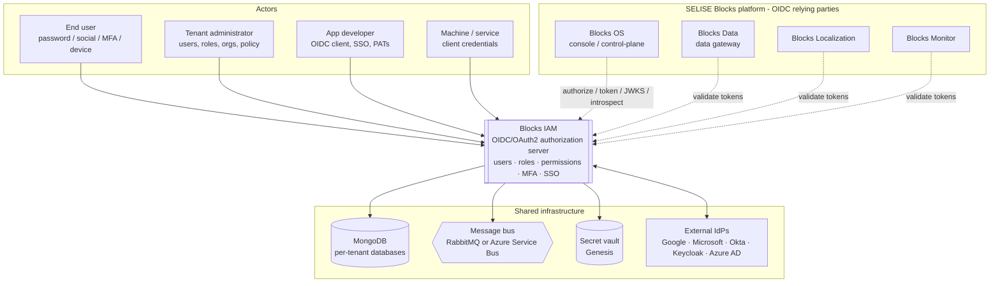
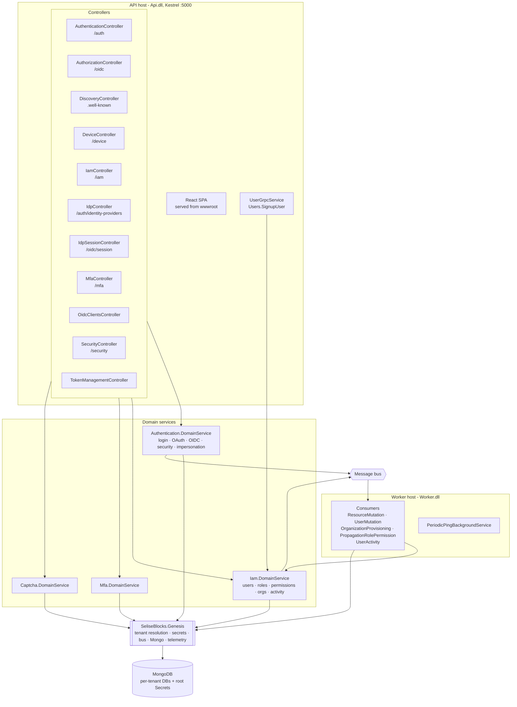
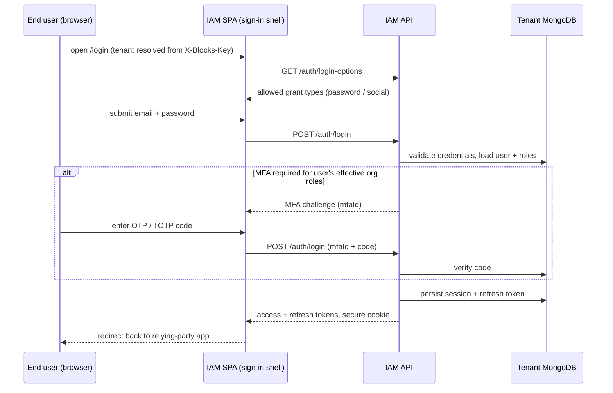
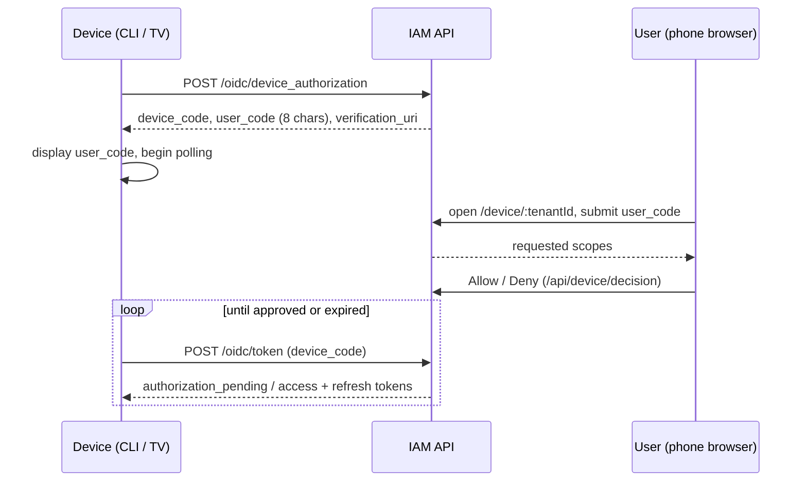

# Blocks IAM — Architecture Specification

> Status: authoritative architecture specification for the `blocks-iam` service. Grounded in the current codebase (@ inception) and reconciled against the answered-ticket decisions in `DECISIONS-blocks-iam.md`. Where the code and a decision disagree, the decision is the TARGET state and the gap is called out explicitly.
>
> Canonical product name: **Blocks IAM** (decision #348). "Blocks Cloud", "IdP", and "blocks-idp" are not the product name — "IdP" is reserved for external / tenant-created identity providers. Internal identifiers that still carry `blocks-idp` (package name `blocks-idp-client`, Docker image labels `blocks-idp-api` / `blocks-idp-worker`, `DEVICE_CODE_FLOW.md`) are out of scope for the user-facing naming decision and tracked separately.

---

## 1. System Context

Blocks IAM is the identity and access-management service and the OAuth 2.0 / OpenID Connect authorization server for the SELISE Blocks platform. It is the single, shared front door: every other Blocks service delegates login to it, and customer-built apps can too. It owns *who a person or machine is* (users, organizations, credentials, MFA, external identity providers) and *what they may do* (org-scoped hierarchical roles and severity-tagged permissions), and it issues, introspects, and revokes the tokens the rest of the platform trusts.

Within the five-service platform, IAM is the identity control-plane. Each sibling is registered as an **OIDC relying party** — the frontend runtime config wires a dedicated `*_CLIENT_ID`, `*_BASE_URL`, and `*_CALLBACK_URL` for every service (`server/Api/Program.cs`, `ApplyFrontendRuntimeSettings`): Blocks OS, Blocks Data, Blocks Localization, Blocks Monitor, plus the further catalog entries (Agents, Logic, Release, Studio, Utilities). Multi-tenancy is uniform across the platform: a tenant is identified by the `X-Blocks-Key` header, and identity/config/roles/tokens are scoped per tenant.



**Correction to the platform brief.** The brief describes IAM as "auth, roles, MFA, SSO." That is accurate but understates it: the code is a full OIDC/OAuth authorization server (device grant, client credentials, introspection/revocation, discovery/JWKS), a multi-organization manager, an impersonation/support tool, and a security self-service + audit surface.

---

## 2. Component Architecture

Blocks IAM ships as **two deployable processes** built from one server solution, plus a React SPA embedded in the API image:

- **API host** (`server/Api`, `Dockerfile`) — ASP.NET Core on .NET 10 (Kestrel). Hosts the REST/OIDC controllers, exposes a gRPC `Users` service, and serves the compiled React SPA from `wwwroot` with SPA fallback to `index.html`.
- **Worker host** (`server/Worker`, `Dockerfile.worker`) — a .NET Generic Host with no HTTP surface. It consumes queued events to provision organizations and propagate role/permission/user changes across organizations and tenants, and runs a periodic-ping background service.
- **Client SPA** (`client/`, React + Vite) — the admin console and all authentication/self-service screens, built into the API's `wwwroot`. Runtime config (client IDs, base URLs, tenant key, captcha site key) is injected at container start by token replacement in the static assets.

The server is organized into domain-service libraries referenced by both hosts: `Authentication.DomainService` (login, OAuth/OIDC, sessions, security, impersonation), `Iam.DomainService` (users, roles, permissions, organizations, accounts, activity, gRPC), `Mfa.DomainService` (TOTP + Email/SMS/WhatsApp OTP + backup codes), `Captcha.DomainService`, `Cloud.DomainService` / `CloudConfiguration.DomainService`, and `Identifier.DomainService`. Cross-cutting concerns (tenant resolution, secrets, logging/tracing, message bus, MongoDB config, API bootstrap) come from the shared **`SeliseBlocks.Genesis`** package.



---

## 3. Key Runtime Flows

### 3.1 Password sign-in with optional MFA (OIDC relying-party context)



**Decisions applied.** MFA is evaluated against role **names**, not org-id keys (#309 hotfix), and the target state resolves the user's **effective organization** (last-used org → `default` → first available) and evaluates policy against `user.Roles[resolvedOrganizationId]` without adding an org id to the login/OIDC payload (#350). A missing org role entry means "no roles" — no fallback to another org. **Gap:** org-scoped evaluation is the target; verify the shipped path matches #350 before relying on it for multi-org users.

### 3.2 Device authorization grant (RFC 8628)



### 3.3 Organization provisioning & role/permission propagation (async)

```mermaid
sequenceDiagram
    participant ADM as Admin
    participant API as IAM API
    participant BUS as Message bus
    participant W as Worker consumer
    participant DB as MongoDB
    ADM->>API: create org / mutate default role or permission
    API->>DB: write at tenant "default" scope
    API->>BUS: publish OrganizationProvisioning / ResourceMutation / PropagationRolePermissionUpdate
    BUS->>W: deliver event (per-queue subscription)
    W->>DB: copy default roles/permissions into org(s); propagate across tenants
    Note over W,DB: eventual consistency — org access converges after publish
```

Roles/permissions authored at the tenant `default` scope (`DefaultOrganizationId = "default"`) are propagated to each organization by the Worker rather than synchronously in the request path.

---

## 4. Data Architecture

**Storage engine.** MongoDB, accessed through the shared Genesis data layer. There is no relational store and no dynamic-schema gateway in IAM — entities are strongly typed C# domain models (User, Organization, Role, Permission, IdentityProvider, OidcClientRegistration, ClientCredential, UserCode, sessions, MFA configuration, activity events).

**Per-tenant database isolation.** Both hosts bootstrap from a **root database** holding a `Secrets` collection (`AddMongoDbConfiguration` with `RootDatabaseName`, `CollectionName = "Secrets"`, `SecretKey = "blocks-secret-iam"` in `Api/Program.cs` and `Worker/Program.cs`). At request time Genesis resolves the tenant from the `X-Blocks-Key` header, looks up that tenant's secret/connection, and routes reads/writes to the tenant's own database — so each tenant's identity data is physically isolated. The tenant-validation middleware is wired for the `api` route prefix (`ConfigureMiddleware(..., tenantValidationPrefixes: new[] { normalizedApiRoutePrefix })`).

**Organizations within a tenant.** Inside a single tenant DB, an Organization is a logical grouping with its own members, default roles/permissions, and branding. The `"default"` organization is the tenant-level authoring scope; the Worker fans changes out to concrete organizations.

**Secrets.** Connection strings, message-bus connection, CORS origins, and signing material are loaded via Genesis from the configured vault (`ResolveVaultType`) plus the Mongo-backed secrets collection — not from `appsettings.json`, which only carries service name, Swagger, logging, and the API route prefix.

**Configuration entities.** Authentication configuration (token lifetimes, lockout thresholds, password-strength regex, OIDC mode), sign-up settings, MFA policy, captcha config, and per-organization branding/locale are all tenant-scoped documents.

---

## 5. AuthN/AuthZ Architecture

**Authorization server.** IAM is a standards-compliant OAuth 2.0 / OIDC provider. Per-tenant discovery is served at `/{tenant}/.well-known/openid-configuration` with JWKS (`DiscoveryController`); the grant surface (`AuthorizationController`, `/oidc/*`) covers authorization-code, refresh (with rotation + reuse detection), client-credentials, and the RFC 8628 device grant, plus RFC 7662 introspection and RFC 7009 revocation (`TokenManagementController`). A browser SSO session can hold multiple accounts (`IdpSessionController`, `/oidc/session/*`).

**Authentication methods.** Email + password (embedded), social OAuth 2.0 + PKCE (Google, Microsoft, GitHub, LinkedIn, X, Apple, Facebook), enterprise "bring-your-own" OIDC/SAML SSO via public-certificate + JWT-claim mapping (`SSOType.BYOSSO`, `IdpController`), MFA (TOTP and Email/SMS/WhatsApp OTP + backup codes), device grant, and machine-to-machine client credentials.

**Tenant identification.** Every application call carries `X-Blocks-Key` (the tenant/project key); the client sets it explicitly (`client/app/idp/iam/services/user.service.ts`) and Genesis middleware validates it and binds the request to the tenant's data. The tenant also appears in the OIDC issuer path and the `tenant_id` claim.

**Permission model.** Endpoints are guarded by `[ProtectedEndPoint("...")]` string scopes. The **decided canonical taxonomy is `service.controller.action`** (#344), e.g. `blocks-iam::iam::users`, `blocks-iam::iam::mutate-roles`, `blocks-iam::auth::client-credentials`. **Gap:** many scopes still use `blocks-iam::iam::*` as a catch-all area where the taxonomy would place `mfa`, `security`, or `oidc-clients`; #344 approves the taxonomy as the standard and schedules an audit/normalization epic (standard lands first, one PR per area). `[Authorize]`-only endpoints are handled separately — some are intentionally open to any authenticated user; converting one to a scoped permission is a data/rollout change (seeding, role templates, frontend checks), not a rename (#344).

**MFA authorization split (#343, target).** Self-service MFA actions (SetupTotp, VerifyTotpSetup, SetMfaMethod, DisableMfa, GenerateOtp, ResendOtp, VerifyOtp) use `[Authorize]` + server-side own-identity validation; admin/tenant MFA policy/config actions require a scoped permission on the `service.controller.action` taxonomy. The backup-code flow is explicitly excluded until reviewed separately.

**API contract conventions (target).** Application endpoints standardize on typed `Task<ActionResult<TResponse>>` with the shared response envelope's `IsSuccess` (#346); OAuth/OIDC RFC-style `{ error, error_description }` endpoints stay isolated as documented protocol exceptions. Route grammar is being standardized as an epic (#345): resource-oriented IAM routes, `mfa` canonicalized with `api/mfa` as a temporary alias, camelCase route params, reads moved POST→GET where safe.

**Naming gap (#348).** The live sign-in card still renders "Blocks Cloud" (`client/app/idp/authentication/pages/login/signin.tsx:112`). The decision is that "Blocks Cloud" must not appear on any IAM-owned sign-in/consent/activation/account-selection screen; fixing the sign-in card is the first task. This is a known gap, not intended behavior.

---

## 6. Deployment Architecture

**Containers.** Two images built from this repo:
- `blocks-idp-api` (`Dockerfile`): multi-stage — Node 22 builds the Vite SPA into `server/Api/wwwroot`, .NET 10 SDK publishes `Api.csproj`, final image is `aspnet:10.0-alpine` running `Api.dll` on port 5000 (`ASPNETCORE_ENVIRONMENT=Production`, non-root `app` user, `icu-libs` for globalization).
- `blocks-idp-worker` (`Dockerfile.worker`): publishes `Worker.csproj`, same Alpine runtime, runs `Worker.dll` with no HTTP host (`DOTNET_ENVIRONMENT=Production`).

Both default to `linux/amd64` publish (documented to avoid Grpc.Tools protoc crashes on some arm64 build hosts).

**Runtime config injection.** The API rewrites token placeholders (`__BLOCKS_*__`) in the built static assets at startup from the `FrontendRuntime` config section, with `FrontendRuntime__BLOCKS_*` env vars overriding per key at deploy time (`ApplyFrontendRuntimeSettings`). This is how each environment's client IDs, base/callback URLs, tenant key (`BLOCKS_X_BLOCKS_KEY`), and captcha site key are set without rebuilding the image.

**CI/CD.** GitHub Actions, one workflow per environment tier — `ci-dev.yml`, `ci-stg.yml`, `ci_prod.yml` — driven by pushes to the matching branch. Pipelines are thin wrappers over shared reusable workflows in `SELISEdigitalplatforms/blocks-inventory`: initialization (loads shared vars), optional SonarQube analysis, optional SCA scan (CycloneDX SBOM → Dependency-Track), `build-push` (builds the API/`webservice` and Worker images, pushes to Azure Container Registry), then `update-gitops-central` (GitOps: updates the central manifests repo with the new image tag). Default image tag strategy is `commit` (git SHA). Tests and Sonar/SCA are toggled off in dev for speed and enabled in higher tiers.

**Environment tiers.** `dev`, `stg`, `prod`, with `uat` also enumerated in the version-selection logic. Dev targets the `aks-blocks-dev` Azure Kubernetes Service cluster; deployment is GitOps-driven onto AKS via the central manifests repo (this service repo does not contain the k8s manifests).

**Messaging & data at runtime.** MongoDB and the message bus (RabbitMQ or Azure Service Bus, selected by the connection string via `IdpConstants.GetMessageConfiguration`) are external managed dependencies reached through Genesis using vault-sourced secrets.

---

## 7. Cross-Service Dependencies

**What IAM depends on:**
- **MongoDB** — per-tenant identity storage and the root `Secrets` collection.
- **Message bus** (RabbitMQ / Azure Service Bus) — decouples the API from the Worker across named queues: `blocks_authentication_listener`, `blocks_iam_listener_user`, `blocks_iam_listener_resource`, `blocks_iam_listener_permission`, `blocks_iam_org_listener`, `blocks_mfa_listener`, `blocks_user_activity_listener`, and `blocks_email_listener` (email dispatch is delegated to a mail listener).
- **Secret vault** (via Genesis) — connection strings, signing keys, CORS origins.
- **External identity providers** — social and enterprise IdPs for federated login.
- **`SeliseBlocks.Genesis`** shared library — tenant resolution, secrets, bus, Mongo, telemetry, API bootstrap.

**What depends on IAM:**
- **Every Blocks service is an OIDC relying party** — Blocks OS, Data, Localization, Monitor (and the wider catalog) validate IAM-issued tokens via JWKS/introspection to authenticate and authorize their own requests. Each has a client ID + callback wired into IAM's frontend runtime config.
- **gRPC consumers** — IAM exposes a `Users` gRPC service (`UserGrpcService.SignupUser`) so other services can provision users programmatically (`server/Iam.DomainService/Protos/Users.proto`).
- **Customer-built apps** — may register as OIDC clients and delegate login to IAM.

**Boundary overlaps (open / undecided).** IAM and Blocks OS both surface users and organizations; the source-of-truth boundary is not resolved by an authoritative decision (question D1). IAM also carries per-org branding/locale (vs Blocks Localization, D5), its own auth/MFA/IAM/captcha log screens plus a rate-limiter stub and a "managed services" screen (vs Blocks Monitor, D2/D4). These are documented as open boundary questions, not decided ownership.

---

## 8. Scalability, Reliability & Observability

**Scalability.** The API host is stateless per request (tenant resolved from the header, session/refresh state persisted in MongoDB), so it scales horizontally behind the AKS ingress. Heavy fan-out work (org provisioning, cross-tenant role/permission propagation, user mutations, activity recording) is offloaded to the Worker via queues, keeping request latency bounded and letting the Worker scale independently. Per-tenant database isolation partitions load and blast radius by tenant.

**Reliability.** Asynchronous propagation gives eventual consistency for org/role/permission changes with the durability and retry semantics of the message bus. Security hardening in the request path: refresh-token rotation with reuse detection, account lockout after failed attempts, captcha gating, MFA policy, forced logout-all on password change, and anti-enumeration password recovery (always "email sent"; inactive accounts silently receive an activation mail). The API exposes ASP.NET Core health checks (`services.AddHealthChecks()`); the Worker runs a periodic-ping background service.

**Observability.** Logging and tracing are configured through Genesis at startup (`ConfigureLogAndSecretsAsync`). IAM additionally emits domain-level user-activity/audit events (via `blocks_user_activity_listener`, consumed by the Worker) and surfaces authentication, MFA, IAM, and captcha log screens plus per-user security summaries in the console. Platform-wide LMT (logs/metrics/traces) is a Blocks OS concern; the identity-vs-monitoring log boundary is an open question (D4).

---

## 9. Architectural Decisions & Trade-offs

**ADR-1 — Two processes (API + Worker) over one.**
*Context:* organization provisioning and role/permission propagation fan out across many organizations and tenants. *Decision:* keep the HTTP API request-path synchronous and push fan-out to a separate Worker consuming bus events. *Consequence:* bounded request latency and independent scaling, at the cost of eventual consistency (org access converges shortly after the mutation, not within the request).

**ADR-2 — Per-tenant MongoDB databases resolved from `X-Blocks-Key`.**
*Context:* a multi-tenant identity store must isolate tenants strongly. *Decision:* resolve the tenant from the `X-Blocks-Key` header via Genesis and route to that tenant's own database, bootstrapped from a root `Secrets` collection. *Consequence:* strong data isolation and per-tenant blast radius; the trade-off is that every request must carry and validate a valid tenant key and cross-tenant queries are intentionally not possible.

**ADR-3 — SPA embedded in the API image with startup token injection.**
*Context:* the same built SPA must run in dev/stg/uat/prod with different client IDs and URLs. *Decision:* serve the Vite build from the API's `wwwroot` and rewrite `__BLOCKS_*__` placeholders at container start from `FrontendRuntime` config / env vars. *Consequence:* one immutable image per release across environments; the trade-off is a startup file-rewrite step and coupling of SPA delivery to the API host.

**ADR-4 — Canonical permission taxonomy `service.controller.action` (#344).**
*Context:* scopes had drifted, with `blocks-iam::iam::*` used as a catch-all area. *Decision:* adopt `service.controller.action` as the product standard and normalize mismatched areas (`mfa`, `security`, `oidc-clients`) under an audit epic, standard landing first. *Consequence:* predictable, auditable scopes; the trade-off is a phased migration touching permission seeding, role templates, and frontend checks — the current code still shows pre-normalization scopes (documented gap).

**ADR-5 — Org-scoped MFA evaluation without changing the token payload (#309, #350).**
*Context:* MFA was evaluated against `user.Roles.Keys`, which are org IDs, not role names — a security defect. *Decision:* ship #309 as a focused hotfix evaluating against role **names**, then make evaluation organization-aware (#350) by resolving the effective org from existing user data (last-used → `default` → first available) without adding an `OrganizationId` to the OIDC/login payload. *Consequence:* correct, org-aware MFA enforcement with no wire-contract change; the trade-off is reliance on the same org-resolution rule as token issuance and careful handling of multi-org users (target state — verify the shipped path).

**ADR-6 — Standard response envelope with `IsSuccess`, RFC OAuth shapes isolated (#346).**
*Context:* endpoints mixed the shared envelope, anonymous error shapes, and raw dictionaries. *Decision:* standardize application endpoints on typed `Task<ActionResult<TResponse>>` + envelope `IsSuccess`, keep OAuth/OIDC `{ error, error_description }` as documented protocol exceptions. *Consequence:* consistent, typed contracts and an OpenAPI that reflects real behavior; the trade-off is a phased refactor across the IAM/Authentication/Security controllers (e.g. `IamController.SetRoles` must read `result.IsSuccess`).

**ADR-7 — Product naming `Blocks IAM`; `Blocks Cloud`/`IdP` retired from user-facing surfaces (#348).**
*Context:* the code carried several names for one product. *Decision:* "Blocks IAM" everywhere users see it; "IdP" reserved for external/tenant identity providers; internal identifiers (`blocks-idp-client`, image labels) deferred to separate tickets. *Consequence:* one coherent product identity; the trade-off is a known gap — the sign-in card still says "Blocks Cloud" (`signin.tsx:112`) and must be fixed first.

**ADR-8 — Temporary anonymous `/auth-login` retained (#342).**
*Context:* a duplicate absolute `/auth-login` route exists. *Decision:* keep it as an intentional temporary anonymous login surface with an explicit `[AllowAnonymous]`, fix its `ProducesResponseType` to the real login/token contract, and document it as temporary and tied to the future device-code-flow replacement. *Consequence:* the security posture becomes intentional and visible; the trade-off is deliberate retention of a compatibility route pending removal.

**Historical note (platform-wide).** The sibling **Blocks Data** service is documented as GraphQL-only after a dual-gateway (GraphQL dev + REST U-turn) period was consolidated. IAM itself has no such gateway history; it has always been a REST + OIDC authorization server with a gRPC side-channel for user provisioning. This is noted only because IAM issues and validates the tokens Blocks Data's gateway trusts.

---

## Open Questions (not resolved by an authoritative decision)

- **D1 — OS vs IAM source of truth** for users and organizations.
- **D2 — Rate-limiter and "managed services"** screens: keep in IAM or move to Monitor/OS.
- **D4 — Identity logs vs monitoring** boundary for security-event investigation.
- **D5 — Per-org branding/locale** ownership (IAM vs Localization).
- **C1/C2 — Primary buyer vs day-to-day user**, and the single website value proposition.
- **B-series product framing** (primary sign-in path, promotion of device flow / multi-account SSO / impersonation guardrails) — product-level, not architectural.
